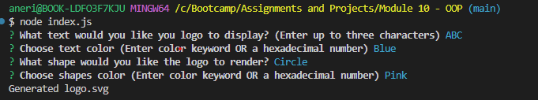
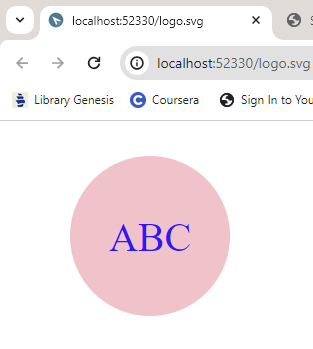

# 10 Object-oriented Programming: SVG Logo Maker

## Description
This application was built as a way to allow web developers to create simple logos for their clients and projects so that they can forego paying a graphic designer. It utilizes inquirer to prompt the user within the command line for how they would like their logo to look (ie. what text they would like their logo to display (up to 3 characters in length), the color of that text, the shape of their logo (triangle, square, or circle) and the color of that shape.) Once the user answers all prompts, then an SVG file is written using their selections to generate a logo. This application also is my first implementation of unit testing within my applications.  I learned the value of unit testing and how this simple example used within my application can be expanded upon for much larger code bases and it's necessity when many developers are all contributing to the same project. Lastly, I have noticed myself starting to think more and more like a developer, adding some minor error handling with the first user prompt: not allowing for a logo to be generated when more than three characters are entered by the user. Future development on this application could start with adding on more error handling (SVG colors), additional unit testing, and adding more polygons and font styles for users to choose from.

## Live Screen Recording Link for Application Functionality
https://drive.google.com/file/d/1oraE3p4azjiQ-OgQxIci0Q_Rg7eEMtrm/view?usp=sharing

## Screenshots

